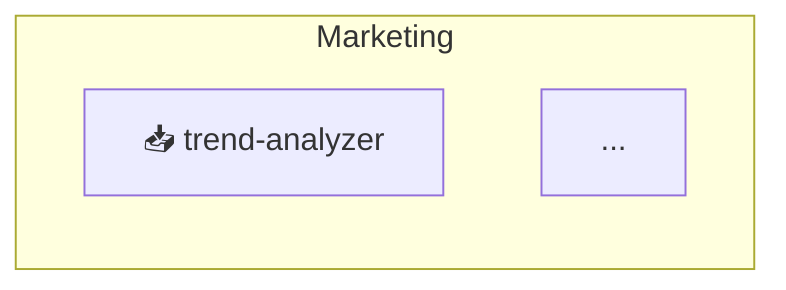

# Motus Recipes

Quick-reference patterns for common Motus tasks. Each recipe is self-contained and copy-paste ready.

## Table of Contents

- [Create a Department with Agents](#1-create-a-department-with-agents)
- [Build a Parallel Data Pipeline](#2-build-a-parallel-data-pipeline)
- [Track Workflow Health](#3-track-workflow-health)
- [Find Unused Agents](#4-find-unused-agents)
- [Export an Org Chart](#5-export-an-org-chart)
- [Backup and Restore a Registry](#6-backup-and-restore-a-registry)
- [Validate Registry Integrity](#7-validate-registry-integrity)
- [Build a Scheduled Daily Briefing](#8-build-a-scheduled-daily-briefing)
- [Remove a Department and All Its Children](#9-remove-a-department-and-all-its-children)
- [Search Across All Registries](#10-search-across-all-registries)

---

## 1. Create a Department with Agents

The minimal sequence to set up a working department programmatically.

```javascript
const { RegistryManager } = require('./index');

const registry = new RegistryManager(__dirname);
await registry.load();

// Create the department
await registry.addDepartment({
  name: 'marketing',
  displayName: 'Marketing',
  description: 'Content, campaigns, and social media automation'
});

// Add a data-fetcher agent
await registry.addAgent({
  name: 'trend-analyzer',
  displayName: 'Trend Analyzer',
  department: 'marketing',
  type: 'data-fetcher',
  description: 'Fetches trending topics from news and social APIs',
  tools: ['Bash', 'WebFetch'],
  model: 'claude-sonnet-4'
});

// Add a specialist agent
await registry.addAgent({
  name: 'content-creator',
  displayName: 'Content Creator',
  department: 'marketing',
  type: 'specialist',
  description: 'Generates blog posts and social copy from research',
  tools: ['Read', 'Write'],
  model: 'claude-sonnet-4'
});

// Wire them into a workflow
await registry.addWorkflow({
  name: 'content-pipeline',
  displayName: 'Content Pipeline',
  department: 'marketing',
  description: 'Research trends and generate weekly content',
  agents: ['trend-analyzer', 'content-creator'],
  trigger: { type: 'scheduled', schedule: '0 9 * * 1' } // Monday 9 AM
});

const summary = await registry.getDepartmentSummary('marketing');
console.log(`${summary.agents.length} agents, ${summary.workflows.length} workflows`);
```

---

## 2. Build a Parallel Data Pipeline

Use separate agents for each data source, then compile results with a specialist.

```javascript
// Step 1: Add parallel data-fetchers
const fetchers = ['weather-fetcher', 'calendar-fetcher', 'task-fetcher'];
for (const name of fetchers) {
  await registry.addAgent({
    name,
    displayName: name.replace(/-/g, ' ').replace(/\b\w/g, c => c.toUpperCase()),
    department: 'briefing',
    type: 'data-fetcher',
    description: `Fetches data from ${name.replace('-fetcher', '')} API`,
    tools: ['Bash'],
    model: 'claude-sonnet-4'
  });
}

// Step 2: Add the compiler
await registry.addAgent({
  name: 'briefing-creator',
  displayName: 'Briefing Creator',
  department: 'briefing',
  type: 'specialist',
  description: 'Compiles all fetched data into a morning briefing note',
  tools: ['Read', 'Write'],
  model: 'claude-sonnet-4'
});

// Step 3: Create the workflow — agents run in the order listed.
// In Claude Code, parallel agents are launched as sub-agents simultaneously.
await registry.addWorkflow({
  name: 'morning-briefing',
  displayName: 'Morning Briefing',
  department: 'briefing',
  description: 'Fetch all data sources, then compile into a briefing',
  agents: [...fetchers, 'briefing-creator'],
  trigger: { type: 'scheduled', schedule: '0 7 * * *' } // Daily at 7 AM
});
```

---

## 3. Track Workflow Health

Record executions and query health status across all workflows.

```javascript
// Record a successful run
await registry.recordWorkflowRun('briefing', 'morning-briefing', {
  success: true,
  durationMs: 12400
});

// Record a failed run
await registry.recordWorkflowRun('briefing', 'morning-briefing', {
  success: false,
  error: 'WeatherAPI timeout after 10s'
});

// Get health status for all workflows
const health = await registry.getWorkflowHealth();
console.log(`Healthy: ${health.summary.healthy}`);
console.log(`Degraded: ${health.summary.degraded}`);
console.log(`Failing: ${health.summary.failing}`);
console.log(`Never run: ${health.summary.idle}`);

// Find all failing workflows
const failing = await registry.getWorkflowHealth({ status: 'failing' });
failing.workflows.forEach(w => {
  console.log(`${w.department}/${w.name}: ${w.successRate * 100}% success — ${w.lastError}`);
});

// Check health for a single department
const deptHealth = await registry.getWorkflowHealth({ department: 'briefing' });
```

**Health status grades:**
- `healthy` — success rate >= 90% and ran within the last 7 days
- `degraded` — success rate 50–90%, or no runs in 7+ days
- `failing` — success rate below 50%
- `idle` — never been run

---

## 4. Find Unused Agents

Identify agents not referenced by any workflow — safe removal candidates.

```javascript
const usage = await registry.getAgentUsage();

// Print a full usage report
console.log(`Total agents: ${usage.agents.length}`);
console.log(`Unused: ${usage.summary.unused}`);
console.log(`High-usage (5+ workflows): ${usage.summary.high}`);

// List unused agents by department
const unused = await registry.getAgentUsage({ usage: 'unused' });
unused.agents.forEach(a => {
  console.log(`Remove candidate: ${a.department}/${a.name} (${a.type})`);
});

// Check for overused agents — potential bottlenecks
const overused = await registry.getAgentUsage({ usage: 'high' });
overused.agents.forEach(a => {
  console.log(`${a.name} used by ${a.workflowCount} workflows:`);
  a.workflows.forEach(w => console.log(`  - ${w.department}/${w.name}`));
});

// Scope to one department and one type
const unusedFetchers = await registry.getAgentUsage({
  department: 'marketing',
  type: 'data-fetcher',
  usage: 'unused'
});
```

---

## 5. Export an Org Chart

Render your entire registry as a Mermaid diagram — paste directly into any GitHub README or Notion page.

```javascript
// Full org chart, left-to-right layout
const diagram = await registry.exportMermaid({
  direction: 'LR',
  title: 'My AI Org Chart'
});
require('fs').writeFileSync('org-chart.mmd', diagram);

// Scope to a single department
const deptDiagram = await registry.exportMermaid({
  direction: 'TD',
  department: 'marketing',
  title: 'Marketing Department'
});

// Agents-only view (no workflow nodes or edges)
const agentsOnly = await registry.exportMermaid({ includeWorkflows: false });

// Surface orphaned agents/workflows (whose department was deleted)
const withOrphans = await registry.exportMermaid({ includeOrphans: true });
```

Paste the output into a fenced code block with `mermaid` as the language:

````markdown

````

---

## 6. Backup and Restore a Registry

Export to JSON for backup, import to restore or migrate to a new environment.

```javascript
// Backup — export all registries to a single object
const backup = await registry.export();
const fs = require('fs');
fs.writeFileSync('motus-backup.json', JSON.stringify(backup, null, 2));
console.log(`Backed up ${Object.keys(backup.departments.departments).length} departments`);

// Restore — import from backup file
const registry2 = new RegistryManager('/path/to/new-install');
await registry2.load();
const data = JSON.parse(fs.readFileSync('motus-backup.json', 'utf8'));
await registry2.import(data);
console.log('Registry restored');

// Validate after restore
const report = await registry2.validate();
if (!report.valid) {
  console.error('Restore issues:', report.errors);
}
```

---

## 7. Validate Registry Integrity

Catch drift, orphaned references, and metadata inconsistencies.

```javascript
// Full registry integrity check
const report = await registry.validate();

if (report.valid) {
  console.log('Registry is healthy');
} else {
  console.error(`Found ${report.errors.length} issue(s):`);
  report.errors.forEach(e => console.error(`  - ${e}`));
}

// Example issues it catches:
//   - Agent type is invalid (not data-fetcher/orchestrator/specialist)
//   - Workflow references an agent that doesn't exist
//   - Agent lists a workflow in usedInWorkflows but that workflow doesn't reference it
//   - Metadata counters are out of sync with actual data

// Also validate that registry JSON files on disk are parseable
const fileReport = await registry.validateFiles();
if (!fileReport.valid) {
  console.error('File issues:', fileReport.errors);
}
```

---

## 8. Build a Scheduled Daily Briefing

End-to-end example: department + agents + workflow + execution tracking.

```javascript
const { RegistryManager } = require('./index');
const registry = new RegistryManager(__dirname);
await registry.load();

// 1. Create department
await registry.addDepartment({
  name: 'life',
  displayName: 'Life OS',
  description: 'Daily personal automation pipelines'
});

// 2. Add agents
const agents = [
  { name: 'weather-fetcher', type: 'data-fetcher', description: 'Fetches weather forecast from WeatherAPI' },
  { name: 'calendar-fetcher', type: 'data-fetcher', description: 'Retrieves today\'s events from Google Calendar' },
  { name: 'task-fetcher', type: 'data-fetcher', description: 'Pulls open tasks from Todoist' },
  { name: 'briefing-writer', type: 'specialist', description: 'Compiles all data into a structured daily briefing note' }
];

for (const { name, type, description } of agents) {
  await registry.addAgent({
    name, displayName: name.replace(/-/g, ' ').replace(/\b\w/g, c => c.toUpperCase()),
    department: 'life', type, description, tools: ['Bash', 'Read', 'Write']
  });
}

// 3. Create the workflow
await registry.addWorkflow({
  name: 'morning-briefing',
  displayName: 'Morning Briefing',
  department: 'life',
  description: 'Parallel data fetch → compile into daily briefing note',
  agents: agents.map(a => a.name),
  trigger: { type: 'scheduled', schedule: '0 7 * * 1-5' }, // Weekdays at 7 AM
  output: { type: 'file', path: 'notes/daily/' }
});

// 4. Simulate a run and record it
const start = Date.now();
// ... your briefing logic runs here ...
await registry.recordWorkflowRun('life', 'morning-briefing', {
  success: true,
  durationMs: Date.now() - start
});

// 5. Check workflow health the next day
const health = await registry.getWorkflowHealth({ department: 'life' });
health.workflows.forEach(w => console.log(`${w.name}: ${w.status}`));
```

---

## 9. Remove a Department and All Its Children

Cascade-delete a department including all its agents and workflows.

```javascript
// Cascade-remove (default) — deletes agents and workflows too
const result = await registry.removeDepartment('old-dept');
console.log(`Removed department: ${result.department.name}`);
console.log(`Removed ${result.removedAgents.length} agents`);
console.log(`Removed ${result.removedWorkflows.length} workflows`);

// Safe remove — fails if children exist
try {
  await registry.removeDepartment('active-dept', { cascade: false });
} catch (err) {
  console.error(err.message); // "Cannot remove: department has 3 agents and 2 workflows"
}

// Remove a single agent (cleans up department lists and workflow references)
const { agent, updatedWorkflows } = await registry.removeAgent('old-fetcher');
console.log(`Removed ${agent.name}, updated ${updatedWorkflows.length} workflows`);

// Remove a single workflow (cleans up department list and agent back-references)
await registry.removeWorkflow('analytics', 'stale-report');
```

---

## 10. Search Across All Registries

Full-text search across departments, agents, and workflows.

```javascript
// Search everything
const results = await registry.search('analytics');
console.log(`Departments: ${results.departments.length}`);
console.log(`Agents: ${results.agents.length}`);
console.log(`Workflows: ${results.workflows.length}`);

results.agents.forEach(a => console.log(`  ${a.name} (${a.type}) — ${a.department}`));

// Get all agents in a department
const agents = registry.listAgentsByDepartment('marketing');

// Get all workflows that use a specific agent
const workflows = await registry.getWorkflowsByAgent('trend-analyzer');
workflows.forEach(w => console.log(`  ${w.department}/${w.name}`));

// Get system-wide statistics
const stats = await registry.getStatistics();
console.log(`${stats.agents.total} agents across ${stats.departments.total} departments`);
console.log(`Agent types: ${JSON.stringify(stats.agents.byType)}`);
```

---

## Tips

**Always call `load()` first.** Every recipe assumes `await registry.load()` has been called. Without it, operations throw `Registries not loaded`.

**Names are immutable.** You cannot rename departments, agents, or workflows via `update*()`. To rename, remove and recreate.

**Agents are cross-workflow.** Add an agent once; reference it in as many workflows as needed. `getAgentUsage()` tracks all references automatically.

**The registry auto-saves.** All `add*()`, `update*()`, `remove*()`, and `recordWorkflowRun()` calls persist to disk automatically — no manual `save()` needed.
