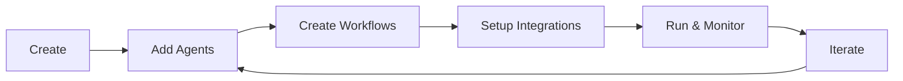
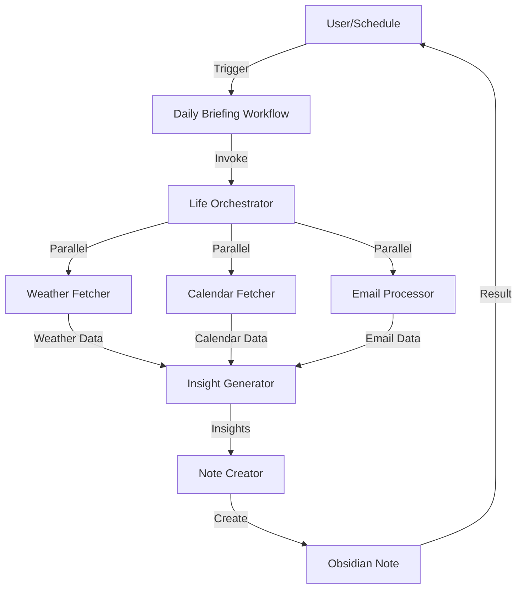

# Core Concepts

Understanding Motus's architecture will help you build powerful automation systems. This guide explains the key concepts and how they work together.

## System Architecture

```
┌─────────────────────────────────────────────────────────────┐
│                         /Motus CLI                          │
└─────────────────┬───────────────────────────────────────────┘
                  │
                  ▼
┌─────────────────────────────────────────────────────────────┐
│                      Departments                            │
│  ┌──────────────┐   ┌──────────────┐   ┌──────────────┐     │
│  │     Life     │   │  Marketing   │   │   Finance    │     │
│  └──────┬───────┘   └──────┬───────┘   └──────┬───────┘     │
└─────────┼──────────────────┼──────────────────┼─────────-───┘
          │                  │                  │
          ▼                  ▼                  ▼
┌─────────────────────────────────────────────────────────────┐
│                        Agents                               │
│  ┌──────────────┐   ┌──────────────┐  ┌──────────────┐      │
│  │ Orchestrator │   │ Data Fetcher │  │  Specialist  │      │
│  └──────┬───────┘   └──────┬───────┘  └──────┬───────┘      │
└─────────┼──────────────────┼──────────────────┼──────────-──┘
          │                  │                  │
          ▼                  ▼                  ▼
┌─────────────────────────────────────────────────────────────┐
│                       Workflows                             │
│           Orchestrate agents to perform tasks               │
└─────────────────┬───────────────────────────────────────────┘
                  │
                  ▼
┌─────────────────────────────────────────────────────────────┐
│                     Integrations                            │
│    Google | Notion | Twitter | Weather | Oura | More        │
└─────────────────────────────────────────────────────────────┘
```

## Departments

### What Are Departments?

Departments are **logical organizational units** that group related agents and workflows together. Think of them as folders that organize your automation.

### Examples

- **Life**: Personal management (calendar, tasks, health)
- **Marketing**: Social media, content, campaigns
- **Finance**: Budgets, expenses, reports
- **Research**: Web scraping, data collection, analysis

### Department Structure

Each department contains:

```
Department
├── Agents (2-10 typically)
│   ├── Department Admin (master orchestrator)
│   ├── Orchestrator (workflow coordinator)
│   ├── Data Fetchers (API calls)
│   └── Specialists (analysis, creation)
├── Workflows (1-5 typically)
│   ├── Daily automated tasks
│   └── On-demand operations
└── Integrations (0-10)
    ├── API keys
    └── OAuth connections
```

### Department Lifecycle



## Agents

### What Are Agents?

Agents are **specialized AI assistants** that perform specific tasks within Claude Code. Each agent has a clear, focused responsibility.

### Agent Types

#### 1. Orchestrators 🎯

**Purpose:** Coordinate multiple agents and manage workflows

**Characteristics:**
- Has access to `Task` tool (can call other agents)
- Manages parallel and sequential execution
- Handles error recovery
- Coordinates complex multi-step processes

**Example:**
```markdown
Name: marketing-orchestrator
Tools: Task, Read, Write
Responsibility: Coordinate daily trend analysis workflow
```

**Use Cases:**
- Workflow coordination
- Multi-agent task management
- Process automation

#### 2. Data Fetchers 📡

**Purpose:** Retrieve data from APIs, databases, and external services

**Characteristics:**
- Has access to `Bash` tool (can run scripts)
- Focuses on data retrieval only
- Usually has an implementation script (.js file)
- Returns structured data (JSON)

**Example:**
```markdown
Name: weather-fetcher
Tools: Bash, Read
Script: life-admin/weather-fetcher.js
Responsibility: Get weather from WeatherAPI
```

**Use Cases:**
- API calls
- Database queries
- File reading
- Web scraping

#### 3. Specialists 🔬

**Purpose:** Analyze data, create content, or make decisions

**Characteristics:**
- Has access to `Read`, `Write`, `WebFetch` tools
- Performs complex analysis or generation
- Can use Claude's intelligence for reasoning
- Produces insights or content

**Example:**
```markdown
Name: sentiment-analyzer
Tools: Read, Write, Task
Responsibility: Analyze social media sentiment
```

**Use Cases:**
- Content creation
- Data analysis
- Decision making
- Report generation

### Agent Anatomy

Every agent has:

```markdown
---
name: agent-name
description: What the agent does
tools: Read, Write, Bash, Task
model: sonnet
---

You are the [Agent Name], responsible for [responsibility].

## Primary Responsibilities
1. [Task 1]
2. [Task 2]

## Capabilities
- [Capability 1]
- [Capability 2]

## Output Standards
Always provide:
- [Standard 1]
- [Standard 2]
```

### Agent Communication

Agents communicate through:

1. **Direct Invocation** - Orchestrators call other agents via `Task` tool
2. **Data Files** - Agents read/write shared files
3. **Return Values** - Agents return structured data to orchestrators

```
Orchestrator
    ├─> Data Fetcher 1 (returns weather data)
    ├─> Data Fetcher 2 (returns calendar events)
    └─> Specialist (analyzes both, returns insights)
```

## Workflows

### What Are Workflows?

Workflows are **automated processes** that combine multiple agents to accomplish complex tasks.

### Workflow Types

#### Manual Workflows

Run on-demand when you invoke them:

```
/motus marketing daily-trends
```

**Use Cases:**
- Ad-hoc analysis
- One-time reports
- User-triggered operations

#### Scheduled Workflows

Run automatically on a schedule:

```json
{
  "trigger": {
    "type": "scheduled",
    "schedule": "daily 9:00",
    "timezone": "Asia/Bangkok"
  }
}
```

**Use Cases:**
- Daily briefings
- Weekly reports
- Monthly analysis

### Workflow Execution Patterns

#### Sequential Execution

Agents run one after another:

```
Step 1: Fetch Weather → Wait for completion
Step 2: Fetch Calendar → Wait for completion
Step 3: Generate Report → Wait for completion
```

**When to use:**
- Later steps depend on earlier results
- Order matters
- Resource constraints

#### Parallel Execution

Multiple agents run simultaneously:

```
Parallel:
  ├─ Fetch Weather (runs concurrently)
  ├─ Fetch Calendar (runs concurrently)
  └─ Fetch Emails (runs concurrently)
Then:
  └─ Generate Report (waits for all)
```

**When to use:**
- Independent data sources
- Speed is important
- No dependencies between steps

### Workflow Structure

```json
{
  "name": "daily-briefing",
  "displayName": "Daily Morning Briefing",
  "department": "life",
  "description": "Generate morning briefing",
  "orchestrator": "life-orchestrator",
  "agents": ["weather-fetcher", "calendar-fetcher", "note-creator"],
  "trigger": {
    "type": "scheduled",
    "schedule": "daily 7:00"
  },
  "output": {
    "type": "file",
    "destination": "data/daily-briefing-{{date}}.md"
  }
}
```

## Integrations

### What Are Integrations?

Integrations are **connections to external services** that your agents use to fetch or send data.

### Integration Types

#### 1. API Key Integrations

**Simple:** Just need an API key

**Examples:**
- Weather API
- Twitter API (basic tier)
- Buffer

**Setup:**
```bash
# Add to .env
WEATHER_API_KEY=your_key_here
```

#### 2. OAuth2 Integrations

**Complex:** Require OAuth flow

**Examples:**
- Google (Calendar, Gmail)
- Facebook
- LinkedIn
- Notion

**Setup:**
```bash
# 1. Add credentials to .env
GOOGLE_CLIENT_ID=your_id
GOOGLE_CLIENT_SECRET=your_secret

# 2. Use OAuth Manager
./start-oauth-manager.sh

# 3. Authorize via browser
```

### Integration Registry

Integrations are defined in department config:

```json
{
  "integrations": [
    {
      "name": "Weather API",
      "type": "api-key",
      "envVars": ["WEATHER_API_KEY"],
      "setup": "Get key from weatherapi.com"
    },
    {
      "name": "Google Calendar",
      "type": "oauth2",
      "envVars": ["GOOGLE_CLIENT_ID", "GOOGLE_CLIENT_SECRET"],
      "setup": "Configure via Google Cloud Console"
    }
  ]
}
```

## Registries

### What Are Registries?

Registries are **central databases** (JSON files) that track all departments, agents, and workflows.

### Registry Files

```
config/registries/
├── departments.json   # All departments
├── agents.json        # All agents
└── workflows.json     # All workflows
```

### Why Registries?

1. **Single Source of Truth** - One place to see everything
2. **Relationships** - Track which agents belong to which departments
3. **Validation** - Ensure consistency across the system
4. **Documentation** - Auto-generate docs from registry data

### Registry Example

**departments.json:**
```json
{
  "departments": {
    "marketing": {
      "name": "marketing",
      "displayName": "Marketing Department",
      "agents": ["marketing-admin", "trend-analyzer"],
      "workflows": ["daily-trends"],
      "created": "2025-10-08"
    }
  }
}
```

## Templates

### What Are Templates?

Templates are **reusable blueprints** for creating agents, departments, and workflows consistently.

### Template Engine

Motus uses Handlebars with 20+ custom helpers:

```handlebars
# {{pascalCase name}} Agent

You are the {{displayName}} agent.

## Tools
{{#each tools}}
- {{this}}
{{/each}}

Created: {{timestamp}}
```

### Template Types

- **Agent Templates** - For different agent types
- **Department Templates** - For department structure
- **Workflow Templates** - For workflow configs
- **Documentation Templates** - For auto-generated docs

## Data Flow

### Complete Example: Daily Briefing



**Step-by-Step:**

1. **Trigger**: Schedule fires at 7:00 AM
2. **Orchestrator**: Life orchestrator coordinates
3. **Data Fetching**: Three agents run in parallel
   - Weather Fetcher calls WeatherAPI
   - Calendar Fetcher calls Google Calendar
   - Email Processor reads Gmail
4. **Analysis**: Insight generator processes all data
5. **Output**: Note creator writes to Obsidian
6. **Complete**: User receives notification

## Best Practices

### Department Organization

✅ **Do:**
- Group related functionality together
- Keep departments focused (not too broad)
- Name departments clearly (marketing, finance, research)

❌ **Don't:**
- Create too many small departments
- Mix unrelated concerns
- Use vague names (misc, stuff, things)

### Agent Design

✅ **Do:**
- Single responsibility per agent
- Clear, descriptive names
- Appropriate tool selection
- Good error handling

❌ **Don't:**
- Make agents do too much
- Give unnecessary tools
- Use generic names (helper, processor)

### Workflow Patterns

✅ **Do:**
- Use parallel execution when possible
- Handle errors gracefully
- Document expected outputs
- Test workflows thoroughly

❌ **Don't:**
- Make workflows too complex
- Chain too many dependencies
- Ignore error cases

## Next Steps

Now that you understand the concepts:

- **[Creating Departments](Creating-Departments.md)** - Build your first department
- **[Creating Agents](Creating-Agents.md)** - Design effective agents
- **[Creating Workflows](Creating-Workflows.md)** - Orchestrate automation
- **[Examples](Examples.md)** - See real implementations

---

**Previous**: [Installation](Installation.md) | **Next**: [Creating Departments →](Creating-Departments.md)
